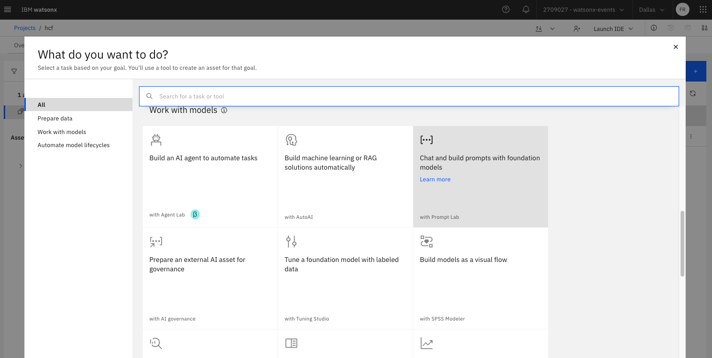
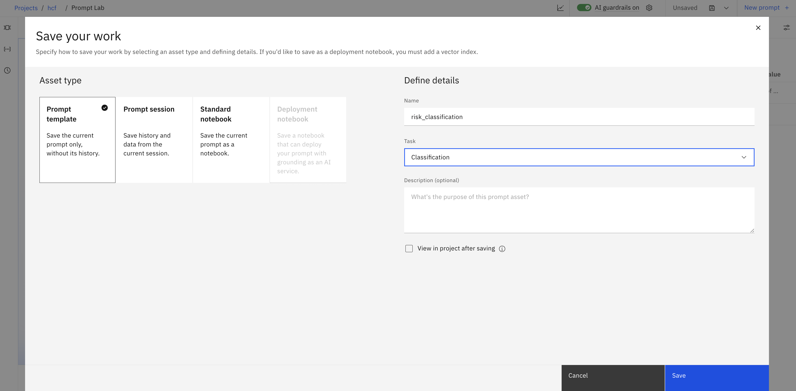
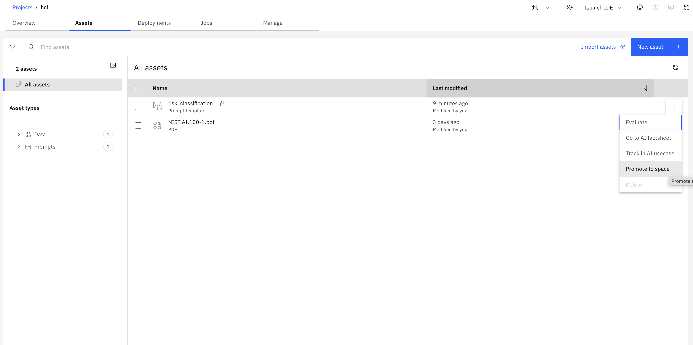
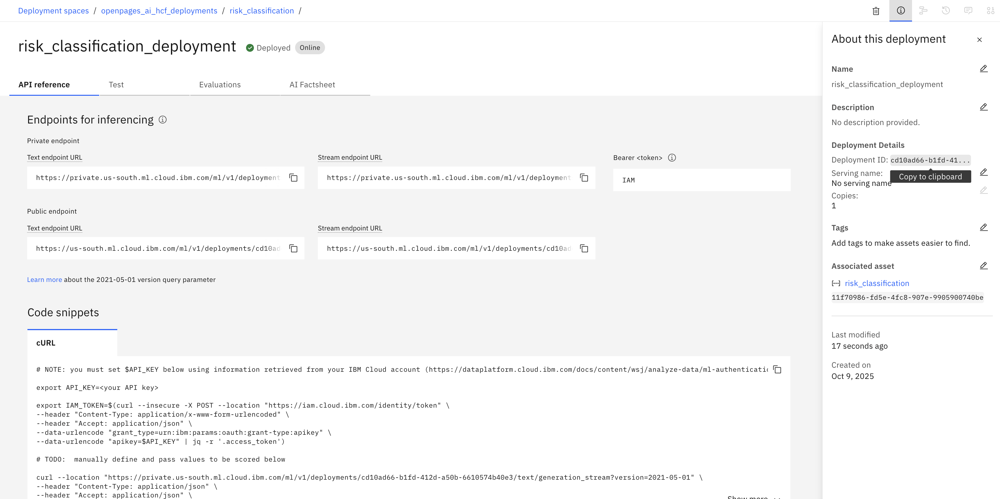

# Lab 1.1: Creating and Deploying a model in watsonx.ai

---

## 1. Set Up and Deploy the prompt in Prompt Lab

1. Create a new Prompt Lab asset in your project.

2. Craft your prompt, with reference to what bits of information will be coming from the object you want the AI feature on. Add this as a variable in the prompt.

3. Save the prompt as a prompt template.

4. Promote asset to deployment space.

5. Deploy asset in deployment space.

6. Note down the deployment ID. We will need this in OpenPages.

