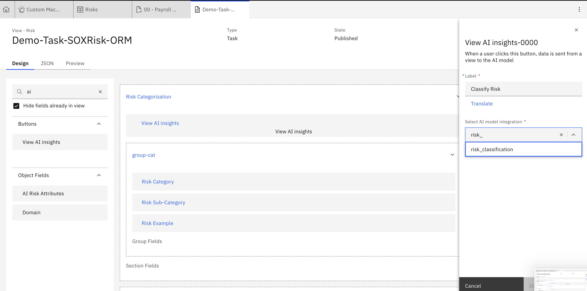
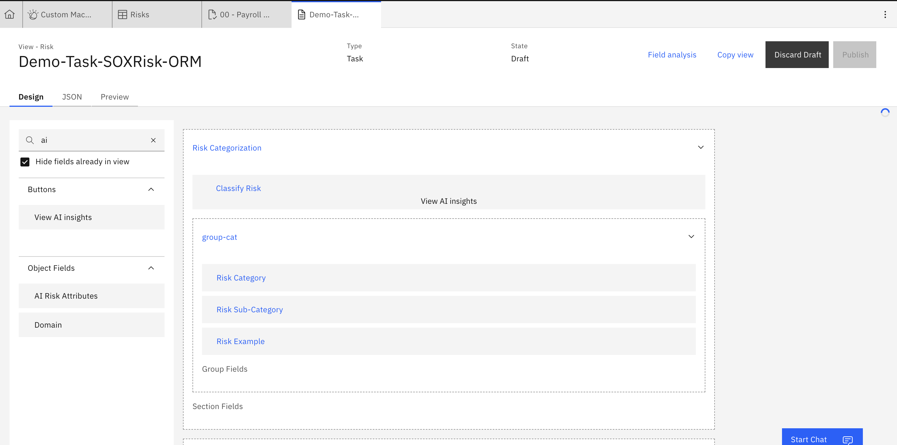
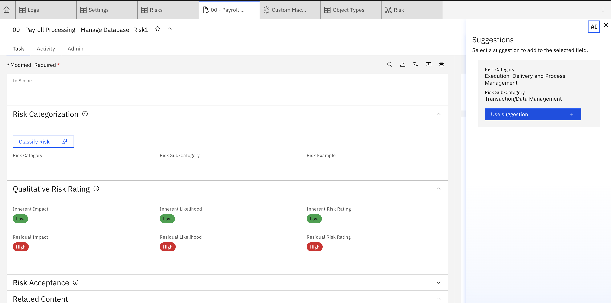

# Lab 1.3: Making the AI feature available in OpenPages

---

## 1. Add the Model to a View

1. The AI model now must be integrated into the view of where we want to interact with it. We want this model on the **Risk** object so we must navigate to the relevant view. Go to any risk and then turn on debug info via the Administration Menu.  

2. The view will then appear beneath the risk heading. Navigate to the view to customize it by clicking on the view name. In the view designer for your object (e.g. Risk view), find the option to add the **View AI insight** button and drag it into the area on the view in which you want to be able to interact with it. For this use-case, we will add it to the Risk Categorisation area. 
 

3. Add the relevant details to the button parameters to connect your model 

 
4. Save or **Publish** the view so the model is active in that view.

---

## 2. Test the Model in OpenPages

1. Navigate to a Risk record in the view where the model is active. 

2. Fill in the **description** (or whatever text triggers the model).  

3. A **lightbulb / insight icon** should appear indicating the model can run (or automatically run). 

4. Click on it and observe the **side panel** with model output suggestions (for Level 1 and Level 2).  
 

5. Validate whether the classifications match expectations.  

6. Test edge cases (no clear classification, ambiguous text) to ensure robustness.  

---

## 3. Troubleshooting & Tips (for Your Risk Taxonomy Use Case)

- Ensure the model prompt or API returns **exact enum strings** that match OpenPages enumerated values.  
- The JSON must be **clean, valid JSON** (no extra text) so JSONata evaluation succeeds.  
- If enum mismatches still occur, build a **mapping / post‑processor** between model output and OpenPages options.  
- Use the **minimum confidence threshold** to suppress low-confidence results.  
- Iteratively refine your prompt / model training to reduce misclassifications or “no insight found” cases.  
- Use **Debug Info** display to view raw JSON and help in refining JSONata expressions or prompt logic.

---