# Lab: Integrating a Custom ML Model for Risk Classification in OpenPages

This lab walks through how to configure and use the *Custom Machine Learning Models* feature in **IBM OpenPages 9.0.0** to automatically classify risk descriptions into your two‑level taxonomy.

You will:

1. Set up and deploy the prompt in Prompt Lab
2. Configure a connection to your deployed model 
2. Map input fields  
3. Map output fields and JSONata expressions  
4. Configure user guidance  
5. Add the model to a view  
6. Test the integration  

> **Prerequisites & Notes**  
> - You must have **Custom Machine Learning Models** permission in OpenPages, otherwise the menu is not visible. :contentReference[oaicite:0]{index=0}  
> - You must already have deployed your classification model (e.g. on Watson ML or another AI service). :contentReference[oaicite:1]{index=1}  
> - You must know the exact enum values for your OpenPages fields (Level 1 / Level 2 classification) so they match the model output.  
> - You should be familiar with **JSONata** syntax to parse model outputs. :contentReference[oaicite:2]{index=2}  

---

## 1. Set Up and Deploy the prompt in Prompt Lab

1. Create a new Prompt Lab asset in your project.


2. Craft your prompt, with reference to what bits of information will be comijhg from the object you want the AI feature on. Add this as a variable in the prompt.
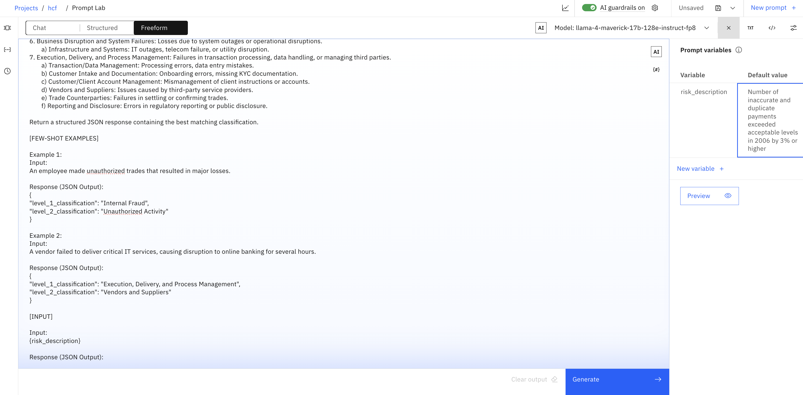

3. Save the prompt as a prompt template.
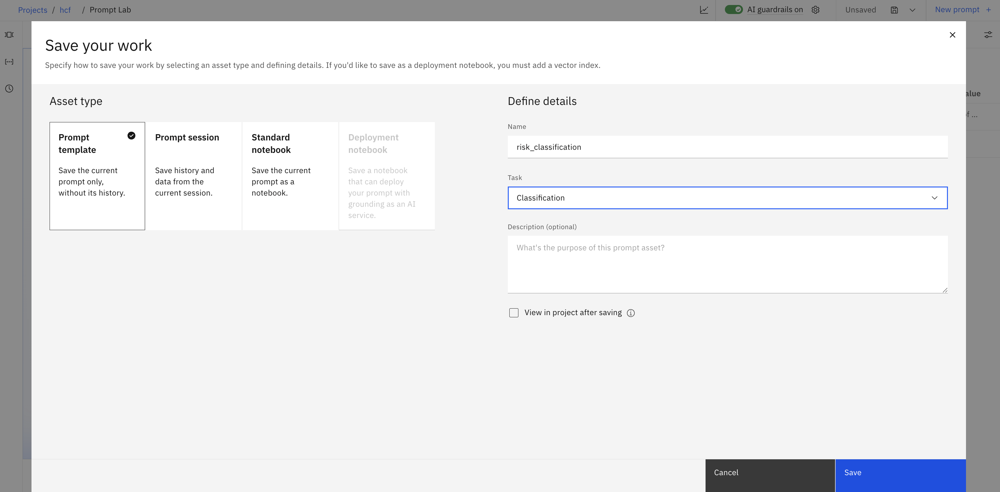

4. Promote asset to deployment space.
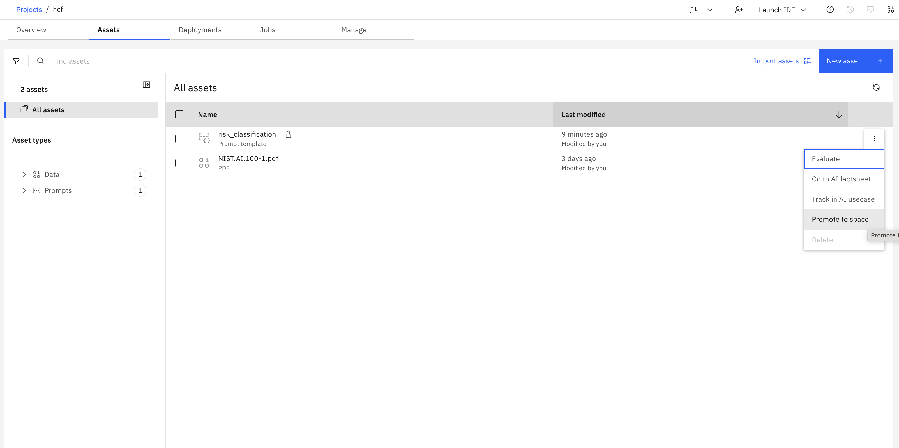

5. Deploy asset in deployment space.
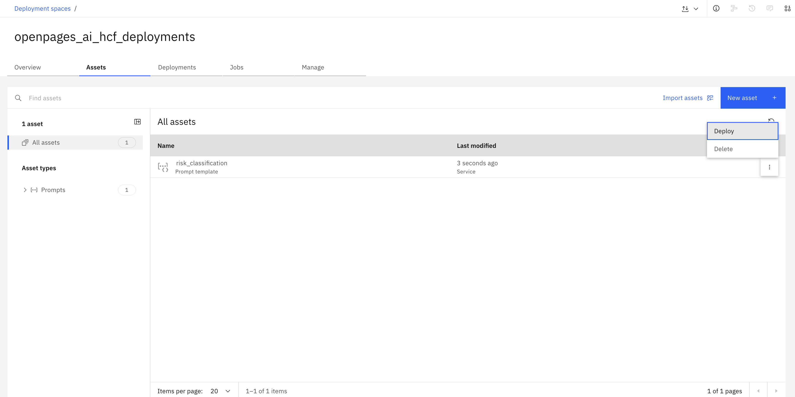

6. Note down the deployment ID. We will need this in OpenPages.
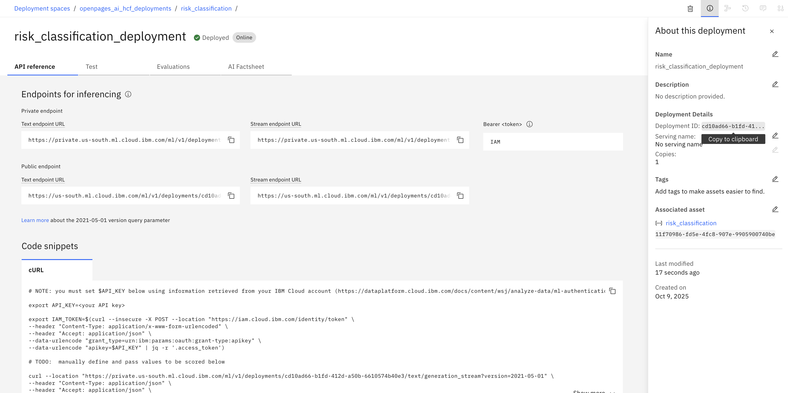

---

## 2. Access the Custom Machine Learning Models Configuration

1. Log in to OpenPages as an admin (with required permissions).  
2. From the **Administration** menu, go to **Integrations → Custom Machine Learning Models**.
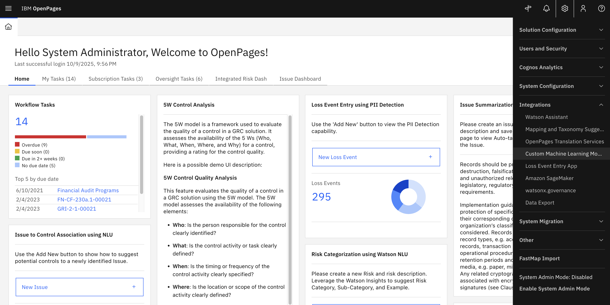

3. Click **New Model** to begin configuring a new integration.  


---

## 3. Configure Model Access / Connection

On the “New Model” screen:

- Enter **Name** and **Label** (e.g. `risk_classification`)  
- Select the **AI Service Type** (e.g. Watson Machine Learning on IBM Cloud)  
- Enter **Access Parameters** such as:  
  - **Watson service type:** *Watson Machine Learning on Cloud*
  - **Authentication URL:** *https://iam.cloud.ibm.com/identity/token*
  - **API Key:** Retrieve from IBM Cloud 
  - **Base Deployment URL:** *https://us-south.ml.cloud.ibm.com/ml/v4*
  - **Deployment ID:** Retrieve from deployment space on watsonx.ai
  - **Space ID:**  Retrieve from model/prompt template deployment on watsonx.ai
  - **API version:** *2021-05-01*  
- Click **Test Connection** to verify connectivity  


Generating your watsonx API key for OpenPages:
- Go to [ibm](https://cloud.ibm.com/)
- Via the tool bar, go to Manage > Acces (IAM)


- Create a new API Key that will be used for inferencing from OpenPages
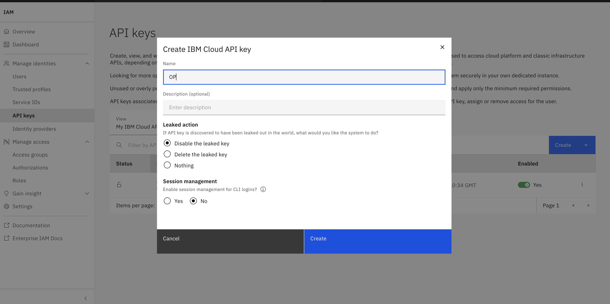

- Copy the new API Key to enter into the "New Model" sceen. Make sure you keep this key a secret.


> After entering valid details, click **Next** to proceed.

---

## 3. Map the Inputs (Model → OpenPages fields)

On the **Map Inputs** page:

1. Choose the **Object Type** (Risk) to which this model applies.


2. Decide whether input is **Manual** or **Automatic** mapping.  

3. Add one row per input your model expects:
   - **Model input field** (must match the name used by your deployed model, e.g. `risk_description`)  
   - Select the corresponding **OpenPages field** (e.g. `Description`)  
   - Mark whether the input is **Required**  
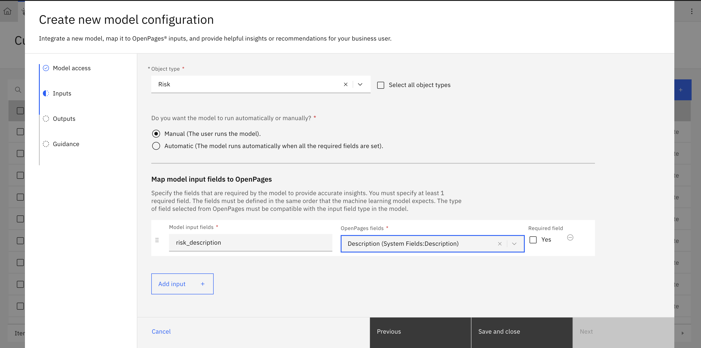

4. Click **Next** to move to output mapping.  
   > (If “Next” is disabled, check that at least one input row is defined.)

---

## 4. Map the Outputs and JSONata Extraction

On the **Map Outputs** page:

1. Select the **Insight type**, e.g. `Set fields` (because you want the model to populate the Level 1 / Level 2 fields)  
   

2. Choose whether each output is **Single insight** or **List of insights** (for your taxonomy, Single is typical) :contentReference[oaicite:3]{index=3}  
3. For each output you want (e.g. Level 1 classification, Level 2 classification):
   - **Output label** (e.g. `PrimaryClassification`, `SecondaryClassification`)  
   - **JSONata expression** to extract the value from the model’s JSON response  
     - Example: if model’s JSON is:  
       ```json
       {
         "level_1_classification": "Clients Products and Business Practices",
         "level_2_classification": "Product Flaws"
       }
       ```
       then JSONata expressions might be:  
       - `level_1_classification`  
       - `level_2_classification`  
     - If the response is wrapped (e.g. under `results.generated_text`), you may need `results.generated_text.level_1_classification` :contentReference[oaicite:4]{index=4}
     

   - (If Insight type = Set fields) **Target field**: map the output to your OpenPages enumerated field  
   
4. Optionally set **Confidence score** or **Minimum confidence thresholds** if your scenario requires filtering suggestions. :contentReference[oaicite:5]{index=5}  
5. (If using `Set fields`) choose whether suggestions are **User set** or **Automatically set**. :contentReference[oaicite:6]{index=6}  
6. Click **Next** to proceed to guidance configuration.

---

## 5. Configure User Guidance and Display

On the **Guidance** page:

1. Enter a **Description** explaining what the model does (e.g. “This model classifies text into risk taxonomy”)  
2. Optionally set **Notification Messages** or **Style / display options** for how users see the model’s suggestion. :contentReference[oaicite:7]{index=7}  
3. Optional: you can embed **JSONata-based conditions** for alerts.  
4. Click **Save** to complete model setup.  
   > The model should now appear in the Custom Machine Learning Models table with status “Complete” (or “V Complete”). :contentReference[oaicite:8]{index=8}  

---

## 6. Add the Model to a View

1. The AI model now must be integrated into the view of where we want to interact with it. We want this model on the **Risk** object so we must navigate to the relevant view. Go to any risk and then turn on debug info via the Administration Menu.  
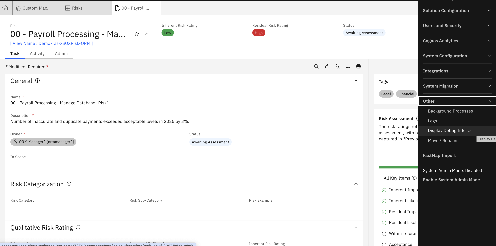

2. The view will then appear beneath the risk heading. Navigate to the view to customize it by clicking on the view name. In the view designer for your object (e.g. Risk view), find the option to add the **View AI insight** button and drag it into the area on the view in which you want to be able to interact with it. For this use-case, we will add it to the Risk Categorisation area. 
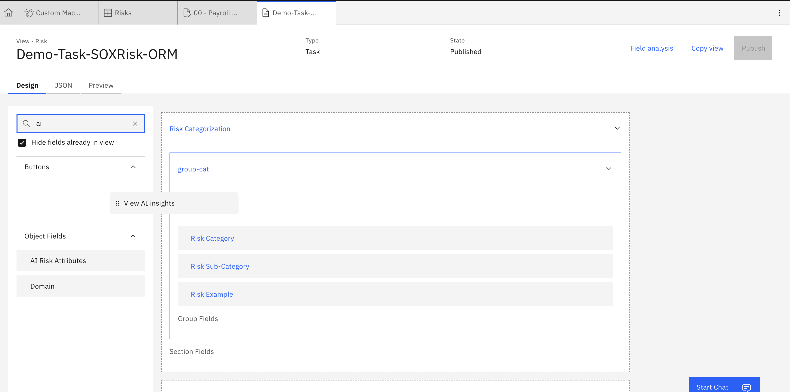 

3. Add the relevant details to the button parameters to connect your model 

 
4. Save or **Publish** the view so the model is active in that view.


---

## 7. Test the Model in OpenPages

1. Navigate to a Risk record in the view where the model is active. 

2. Fill in the **description** (or whatever text triggers the model).  

3. A **lightbulb / insight icon** should appear indicating the model can run (or automatically run). :contentReference[oaicite:9]{index=9}  

4. Click on it and observe the **side panel** with model output suggestions (for Level 1 and Level 2).  
 

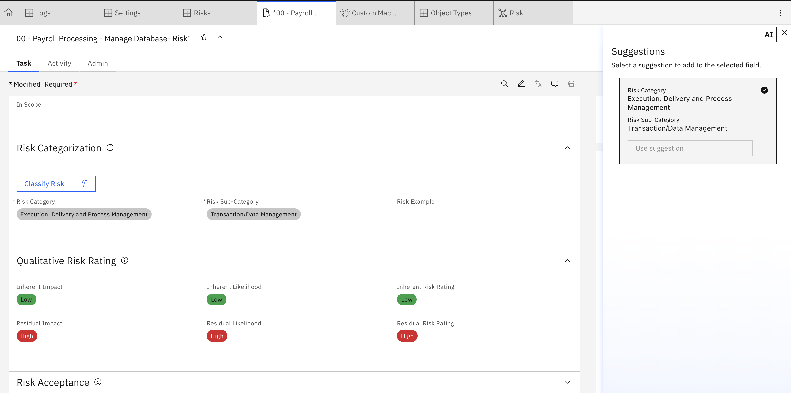

5. Validate whether the classifications match expectations.  

6. Test edge cases (no clear classification, ambiguous text) to ensure robustness.  

---

## 8. Troubleshooting & Tips (for Your Risk Taxonomy Use Case)

- Ensure the model prompt or API returns **exact enum strings** that match OpenPages enumerated values.  
- The JSON must be **clean, valid JSON** (no extra text) so JSONata evaluation succeeds.  
- If enum mismatches still occur, build a **mapping / post‑processor** between model output and OpenPages options.  
- Use the **minimum confidence threshold** to suppress low-confidence results.  
- Iteratively refine your prompt / model training to reduce misclassifications or “no insight found” cases.  
- Use **Debug Info** display to view raw JSON and help in refining JSONata expressions or prompt logic.

---

## 9. Example JSON Prompt / Response for Your Taxonomy

Below is a skeleton prompt and expected response format (to help you align model output with JSONata):

**Prompt (to model):**

```text
You are a classifier. Given a description of a risk event, pick one Level 1 (primary) and one Level 2 (subcategory) from this taxonomy:

Level 1 options:
- Internal Fraud
- External Fraud
- Employment Practices and Workplace Safety
- Clients Products and Business Practices
- Damage to Physical Assets
- Business Disruption and System Failures
- Execution Delivery and Process Management

Level 2 options (examples per Level 1):
- Internal Fraud → Theft and Fraud, Unauthorized Activity  
- External Fraud → Systems Security, Theft and Fraud  
- Employment Practices and Workplace Safety → Employee Relations, Safe Environment, Diversity and Discrimination  
- Clients Products and Business Practices → Product Flaws, Selection Sponsorship and Exposure, Improper Business or Market Practices, Suitability, Disclosures or Fiduciary, Advisory Activities  
- Damage to Physical Assets → Wilful damage, Disaster and other events  
- Business Disruption and System Failures → Infrastructure and Systems  
- Execution Delivery and Process Management → Vendors and Suppliers, Trade Counterparties, Transaction Data Management, Customer Client Account Management, Reporting and Disclosure, Customer Intake and Documentation  

Return only valid JSON in this form (no extra text):

```json
{
  "level_1_classification": "Clients Products and Business Practices",
  "level_2_classification": "Product Flaws"
}
