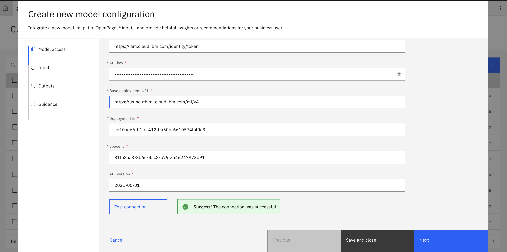
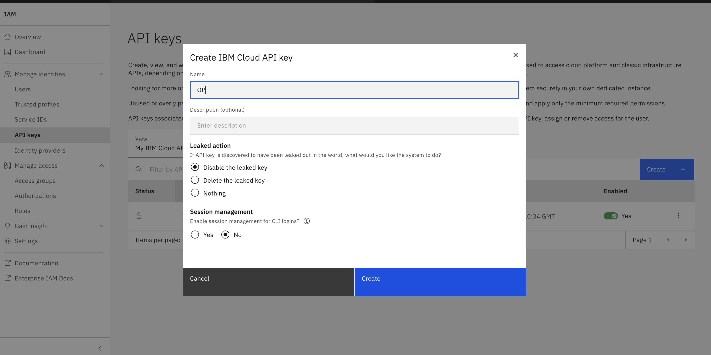

# Lab 1.2: Integrate the model in OpenPages

---

## 1. Access the Custom Machine Learning Models Configuration

1. Log in to OpenPages as an admin (with required permissions).  
2. From the **Administration** menu, go to **Integrations → Custom Machine Learning Models**.


3. Click **New Model** to begin configuring a new integration.  


---

## 2. Configure Model Access / Connection

On the “New Model” screen:

- Enter **Name** and **Label** (e.g. `risk_classification`)  
- Select the **AI Service Type** (e.g. Watson Machine Learning on IBM Cloud)  
- Enter **Access Parameters** such as:  
  - **Watson service type:** *Watson Machine Learning on Cloud*
  - **Authentication URL:** *https://iam.cloud.ibm.com/identity/token*
  - **API Key:** Retrieve from IBM Cloud 
  - **Base Deployment URL:** *https://us-south.ml.cloud.ibm.com/ml/v4*
  - **Deployment ID:** Retrieve from deployment space on watsonx.ai
  - **Space ID:**  Retrieve from model/prompt template deployment on watsonx.ai
  - **API version:** *2021-05-01*  
- Click **Test Connection** to verify connectivity  


Generating your watsonx API key for OpenPages:
- Go to [ibm](https://cloud.ibm.com/)
- Via the tool bar, go to Manage > Acces (IAM)


- Create a new API Key that will be used for inferencing from OpenPages


- Copy the new API Key to enter into the "New Model" sceen. Make sure you keep this key a secret.


> After entering valid details, click **Next** to proceed.

---

## 3. Map the Inputs (Model → OpenPages fields)

On the **Map Inputs** page:

1. Choose the **Object Type** (Risk) to which this model applies.


2. Decide whether input is **Manual** or **Automatic** mapping.  

3. Add one row per input your model expects:
   - **Model input field** (must match the name used by your deployed model, e.g. `risk_description`)  
   - Select the corresponding **OpenPages field** (e.g. `Description`)  
   - Mark whether the input is **Required**  


4. Click **Next** to move to output mapping.  
   > (If “Next” is disabled, check that at least one input row is defined.)

---

## 4. Map the Outputs and JSONata Extraction

On the **Map Outputs** page:

1. Select the **Insight type**, e.g. `Set fields` (because you want the model to populate the Level 1 / Level 2 fields)  
   

2. Choose whether each output is **Single insight** or **List of insights** (for your taxonomy, Single is typical) :contentReference[oaicite:3]{index=3}  
3. For each output you want (e.g. Level 1 classification, Level 2 classification):
   - **Output label** (e.g. `PrimaryClassification`, `SecondaryClassification`)  
   - **JSONata expression** to extract the value from the model’s JSON response  
     - Example: if model’s JSON is:  
       ```json
       {
         "level_1_classification": "Clients Products and Business Practices",
         "level_2_classification": "Product Flaws"
       }
       ```
       then JSONata expressions might be:  
       - `level_1_classification`  
       - `level_2_classification`  
     - If the response is wrapped (e.g. under `results.generated_text`), you may need `results.generated_text.level_1_classification` :contentReference[oaicite:4]{index=4}
     

   - (If Insight type = Set fields) **Target field**: map the output to your OpenPages enumerated field  
   
4. Optionally set **Confidence score** or **Minimum confidence thresholds** if your scenario requires filtering suggestions. :contentReference[oaicite:5]{index=5}  
5. (If using `Set fields`) choose whether suggestions are **User set** or **Automatically set**. :contentReference[oaicite:6]{index=6}  
6. Click **Next** to proceed to guidance configuration.

---

## 5. Configure User Guidance and Display

On the **Guidance** page:

1. Enter a **Description** explaining what the model does (e.g. “This model classifies text into risk taxonomy”)  
2. Optionally set **Notification Messages** or **Style / display options** for how users see the model’s suggestion. :contentReference[oaicite:7]{index=7}  
3. Optional: you can embed **JSONata-based conditions** for alerts.  
4. Click **Save** to complete model setup.  
   > The model should now appear in the Custom Machine Learning Models table with status “Complete” (or “V Complete”). :contentReference[oaicite:8]{index=8}  

