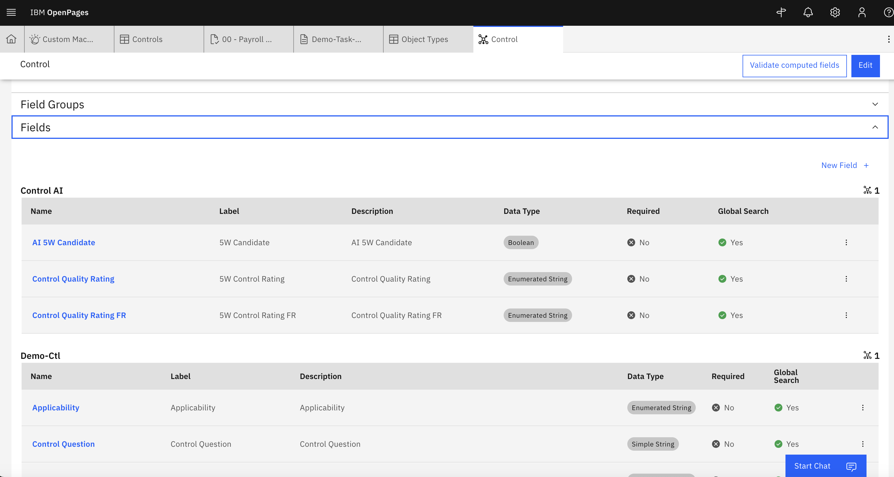
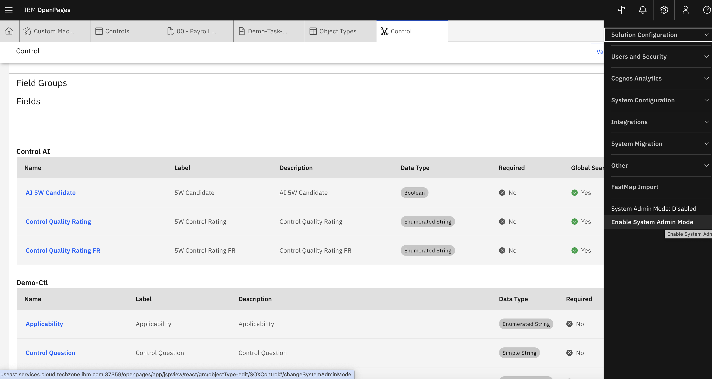
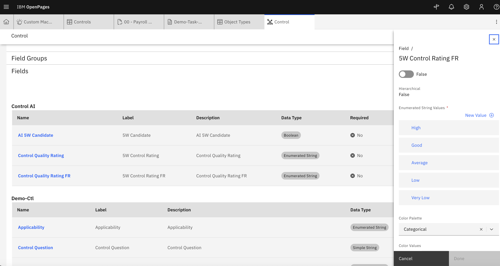
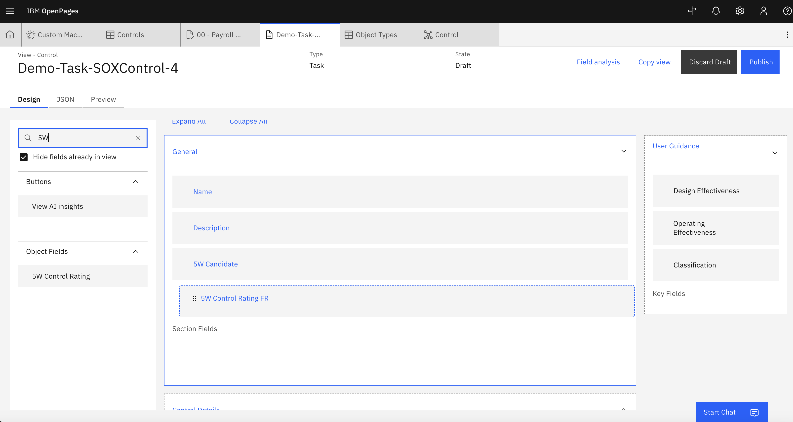

# Lab 2.1: Modifying an Object in OpenPages

In order to display the AI results, we need to modify the relevant OpenPages object, **Control**, to add fields pertaining to the results we want to see. 

---

## 1. Adding Object Fields to Relevant Object Type

1. From the **Administration** menu, go to **Solution Configuration → Object** 

2. Find **Control** in the search table.

3. Expand **Fields** and look for the **Control AI** field group. This is where we will add our 5W AI analysis output - the control quality rating. 
 

4. Via the **Administration** menu, click on **Enable System Admin Mode**. This creates a database lock so that object fields can be modified.
 

5. Back in the Control object configuration, Click on **New Field +**.

6. Add a meaningful name, label and description. The data type is  and The data type is `Enumnerated String` with the values matching to the taxonomy that should be output by the AI model.
 

7. Save, and disable system admin mode after the field group has been created.

---

## 2. Adding the New Object Fields to the Control View

1. As in Lab 1.3, navigate to the view customiser for a **Control**.

2. Add in the new field created for the **5W Control Rating** into the view

3. Publish the view.
