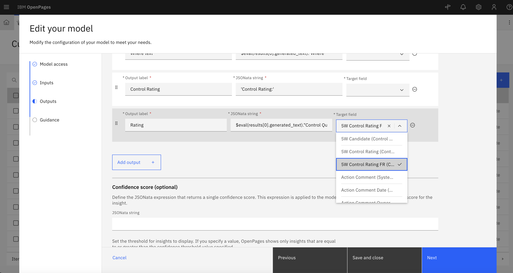

# Lab 2.2: Set-up and Integrate AI Model

---

## 1. Create and Deploy the Prompt Template in watsonx.ai

1. As per Lab 1.1, create an AI deployment in watsonx.ai for 5W analysis. Use the Control Description as input, and output each of the 5 Ws as well as the Control Rating. Ensure that the Control Rating output aligns with the taxonomy created in Lab 2.1. Here is something to get you started:

``` 
[INSTRUCTION]

> Define the purpose of the AI and it's task <

Control Description Format:
> Define the input and the definition of each 5W it should ideally contain <

Output you need to give within a single json object:
1. > Provide the instruction to extract the 5Ws <
2. > Provide the instruction to generate the Control Quality < 
4. > Provide the instruction to generate the explanation of the Control Quality <

Generate only a json object, no post script tagging such as [END OF INSTRUCTION].

[FEW-SHOT EXAMPLES]

Example 1:
Control Description:
"All automated and manual alerts must be assessed in a timely manner in line with the Investigations Standard Operating Procedure (SOP) by investigators and adhere to internal tolerances (WHY). The requirements are outlined in the Institutional Investigations SOP and the Investigation Timing, Tolerances & Appetite document. The Investigations team Lead (WHO) monitors the timeliness of alert assessment at least twice weekly (WHEN) via the Transaction Monitoring and Investigations Dashboard. Metrics (WHAT) are discussed at the monthly Finance Oversight Forum prior to being presented at the Global Working Group Forum. Exceptions are escalated to Head of Finance. Email evidence of escalations and metrics reported to the forums are saved in the Finance SharePoint (WHERE)."

Question:
What is the JSON Output with no markup and no backticks for 5W description analysis?

Response (JSON Output):
{
"Who": > The who <,
"What": > The what <,
"When": > The when <,
"Where": > The where <,
"Why": > The why <,
"Control Quality": > The control quality <,
"Control Quality Explain": > An explanation of why the control quality is the way it is<
}

Example 2:
Control Description:
"Multiple levels of review and challenge of the stress testing assumptions and results, from R&CA team members to Division Head to CEO of the Group and the Bank."

Question:
What is the JSON Output with no markup and no backticks for 5W description analysis?

Response (JSON Output):
{
"Who": > The who <,
"What": > The what <,
"When": > The when <,
"Where": > The where <,
"Why": > The why <,
"Control Quality": > The control quality <,
"Control Quality Explain": > An explanation of why the control quality is the way it is<
}

Example 3:
Control Description:
"Why: The control objective is to ensure the adequacy of professional indemnity insurance arrangements for Customer Finance.\nWhat: On an annual basis, Custody and Product Management review the adequacy of the compensation and insurance arrangements for Customer Finance. In assessing the adequacy of the PI insurance cover, the following information is reviewed: \n•\tCustomer Finance’s business activities and financial position \n•\tInformation about the PI insurance cover against the requirements under ASIC Regulatory Guide
RG126\nWho: The review is coordinated by The Office of the Trustee with the input from Product Management. \n" 

Question:
What is the JSON Output with no markup and no backticks for 5W description analysis?

Response (JSON Output):
{
"Who": > The who <,
"What": > The what <,
"When": > The when <,
"Where": > The where <,
"Why": > The why <,
"Control Quality": > The control quality <,
"Control Quality Explain": > An explanation of why the control quality is the way it is<
}

Example 4:
Control Description:
"[WHO] Prudential Risk CARM, \n[WHAT] as data consumers, provides performs appropriate checks and reviews of input data, including through variance analysis and four-eyes checks (multiple reviews within Prudential Risk CARM) as outlined in the calculation, Monitoring and Reporting procedures \n[WHEN] Every quarter, both before (input data check) and after (variance analysis, four-eyes check) generating dashboard, \n[WHY] To verify the input data and how it is processed by the dashboard, and identify data issues which may require rectification  \n[WHERE] Evidence of the above review and variance analysis is saved in the SharePoint."

Question:
What is the JSON Output with no markup and no backticks for 5W description analysis?

Response (JSON Output):
{
"Who": > The who <,
"What": > The what <,
"When": > The when <,
"Where": > The where <,
"Why": > The why <,
"Control Quality": > The control quality <,
"Control Quality Explain": > An explanation of why the control quality is the way it is<
}

Example 5:
Control Description:
"[WHO] Credit Group [WHAT] notify senior management and escalate [WHEN] which have exceeded APS221 prudential limit thresholds of 25%. [WHY] This is to support regulatory reporting obligations and to provide transparency over management and mitigation of material large exposures.[WHERE] Evidence of large exposure escalations are recorded in an appropriate register."

Question:
What is the JSON Output with no markup and no backticks for 5W description analysis?

Response (JSON Output):
{
"Who": > The who <,
"What": > The what <,
"When": > The when <,
"Where": > The where <,
"Why": > The why <,
"Control Quality": > The control quality <,
"Control Quality Explain": > An explanation of why the control quality is the way it is<
}

[INPUT]

Control Description:
{control_description}

Question:
What is the JSON Output with no markup and no backticks for 5W description analysis?

Response (JSON Output):
```

---

## 2. Integrating Deployed AI Model to OpenPages

1. Once the AI model is deployed in watsonx.ai, it can be integrated into OpenPages. As per Lab 1.2, configure a Custom Machine Learning Model and set up the **Model access** and **Inputs**. 


2. For **Outputs**, add outputs for headers for each of the 5Ws (for formatting), as well as the actual output text with the JSONata string that translates the AI model output. Ensure that the Control Rating is set to the target field created in lab 2.1. 



3. Add a suitable dscription and customise the style to your choosing in **Guidance**. Save the model.

---

## 3. Add the Model to Control View 

1. Navigate to the control object view as per Lab 2.1 to add the AI model we deployed.

2. Rather than add a new AI button, navigate to the **Description** field and add the 5W model to **AI model configuration**. Click Done and publish the view.


---

## 4. Test the Model in OpenPages

1. Find an example control, and run the 5W AI model that appears near the control description. The rating output will populate the **5W Control Rating** field created before.

