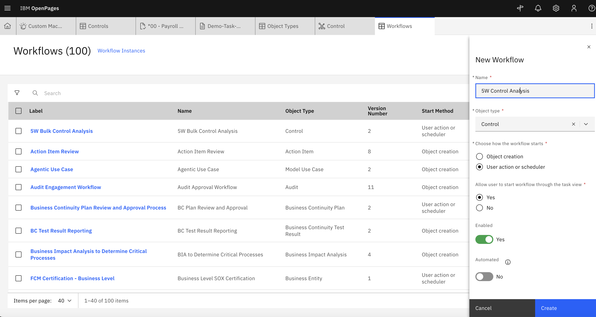
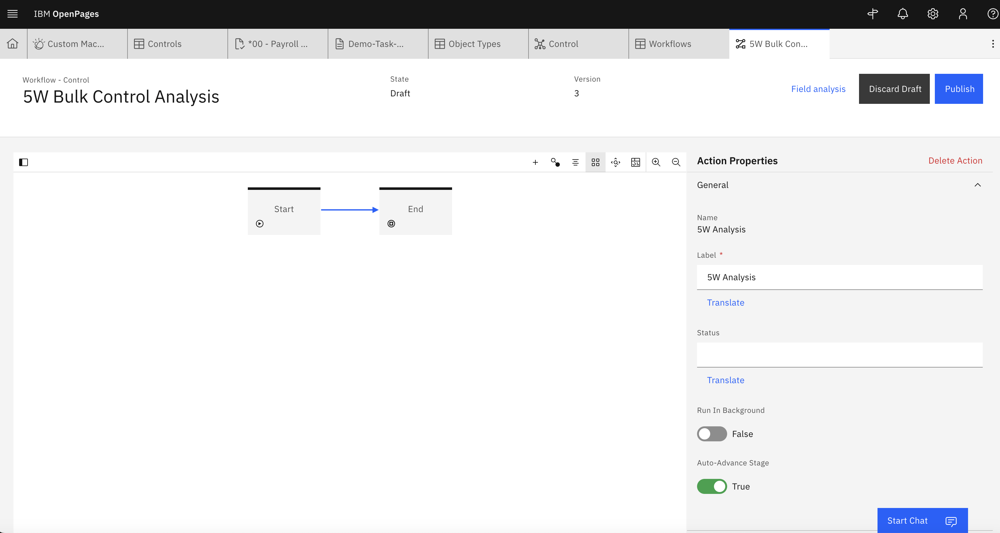
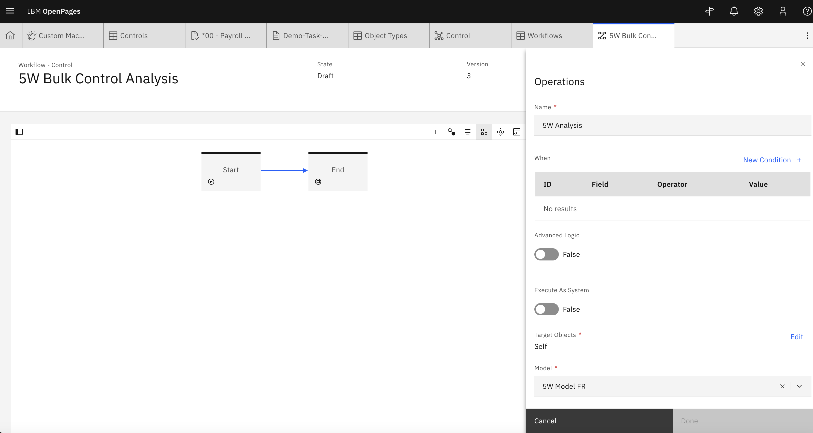
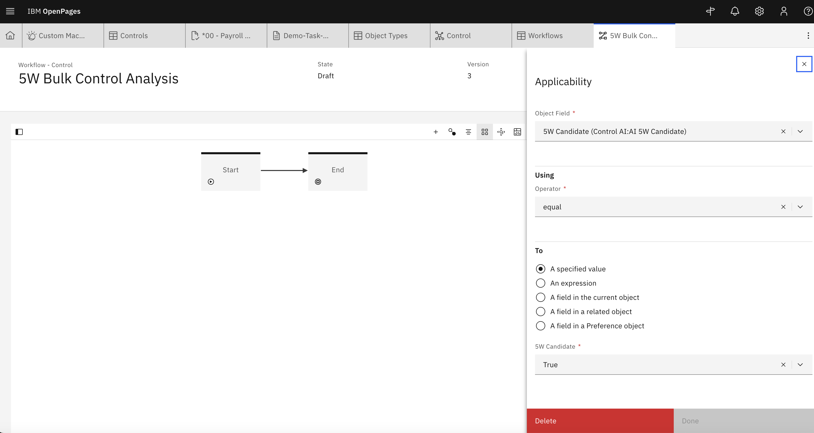
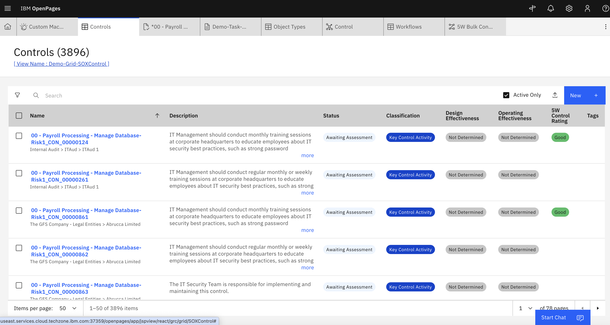
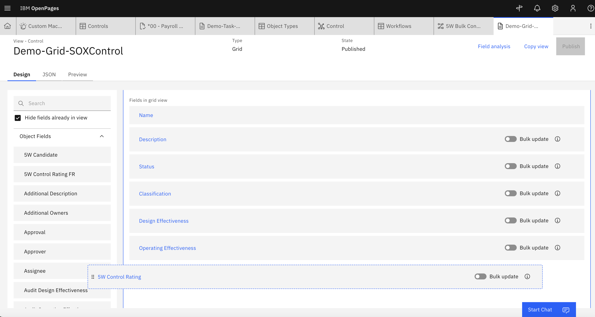
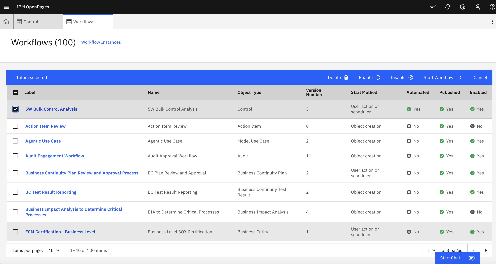
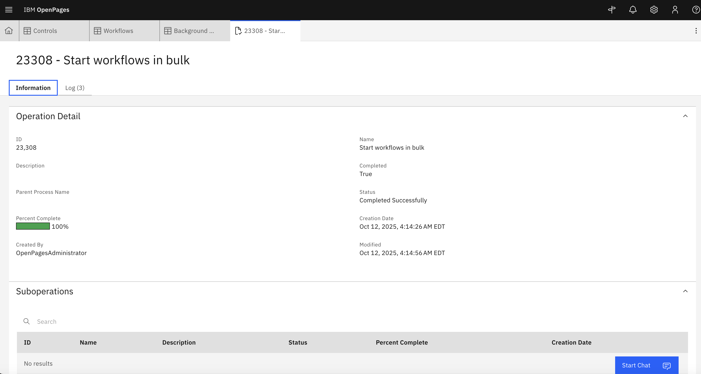
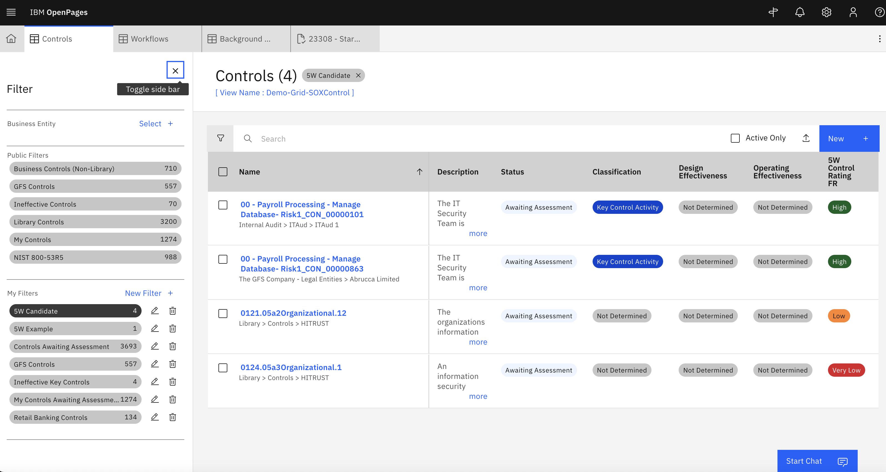

# Lab 2.3: Execute AI in Bulk

So far, we have been executing AI through user interactions - let's look at how we can apply AI at scale. 

---

## 1. Create workflow

1.  So that we don't execute the AI against every single control, first identify candidate records. We can do this by adding a dummy field called '5W Candidate', adding it to the Control view and then setting this as a valid value for a few controls. Later we will add it as a condition for the workflow.

2. From the **Administration** menu, go to **Solution Configuration → Workflows** 

3. Create a new workflow. Provide the following parameters:
  - **Name:** Add a suitable name
  - **Object type:** `Control`
  - **Choose how the workflow starts:** `User action or scheduler` 
  - **Allow user to start workflow through the task view:** `Yes`
  - **Enabled:** `Yes`
  - **Automated:**  `No`  

4. Add only a start and end block. 

5. Add an action connecting the start to the end block. Provide the following:
  - **Name:** Add a suitable name
  - **Label:** Add a suitable label
  - **Run In Background:** `False` 
  - **Auto-Advance Stage:** `True`

6. Provide no conditions. Click **New Operation +** under Validations and Operations to add the AI model. 

7. For the new operation, provide the following:
  - **Operation:** `Run an AI Model`
  - **Name:** Add a suitable name
  - **When:** Keep empty
  - **Advanced Logic:** `False` 
  - **Execute As System:** `False` 
  - **Target Objects:** `Self` 
  - **Model:** Select your deployed AI model

8. Clicking on the empty area in the canvas will display the **Workflow Properties**. Scroll down to Applicability and click **New Condition +**.

8. In the new condition, ensure that the 5W Candidate field created earlier is equal to a specific value that you set candidate records as.

9. Publish the workflow.

---

## 2. View Results at Scale

1. Modify the Control Grid View to see the 5W results at a high level. Via the hamburger menu, navigate to **Assessments > Controls**.

2. With Debug Info displayed, naviagte to the View for the Control Grid. 
[screenshot with cursor hovering over the control grid view name]

3. Add the 5W Control Rating field to the grid and publish the view.

---

## 3. Test the Bulk AI Execution

1. Go back to the workflows page.

2. Select the workflow created for the 5W Bulk Control Analysis and start the workflow.

3. We can check the progress of the workflow in **Administration** menu, go to **Other → Background Processes** 

4. We can see the output by going to our Control grid view and using the 5W Candidate field as a filter
