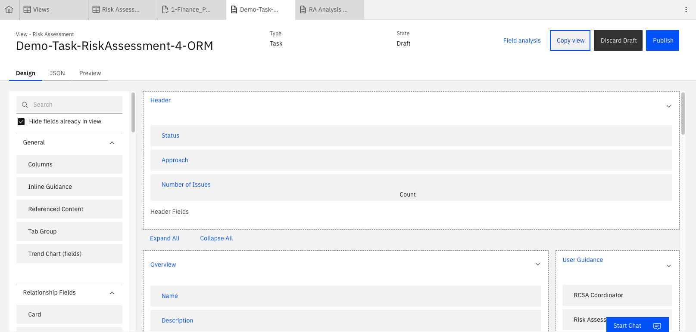
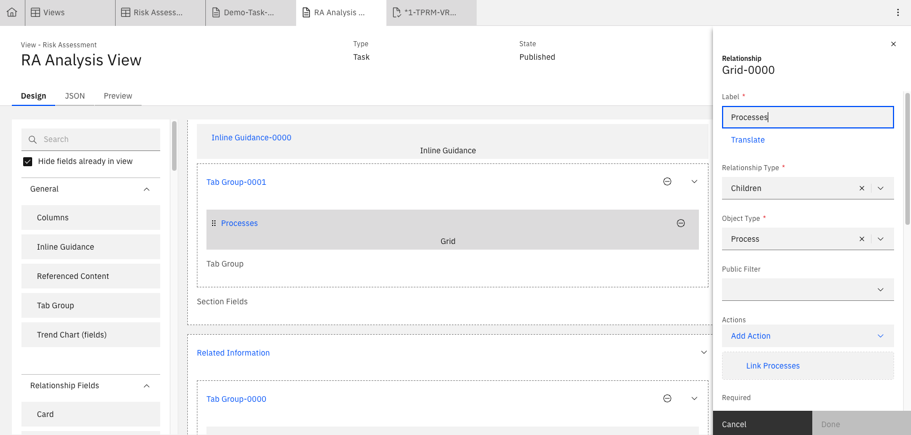
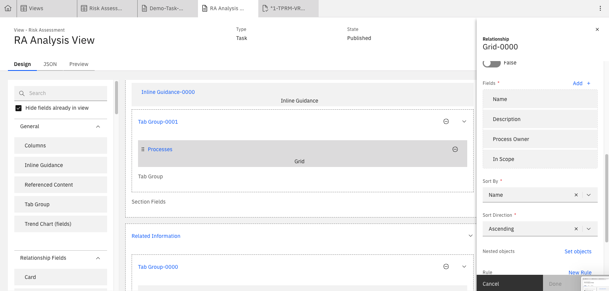
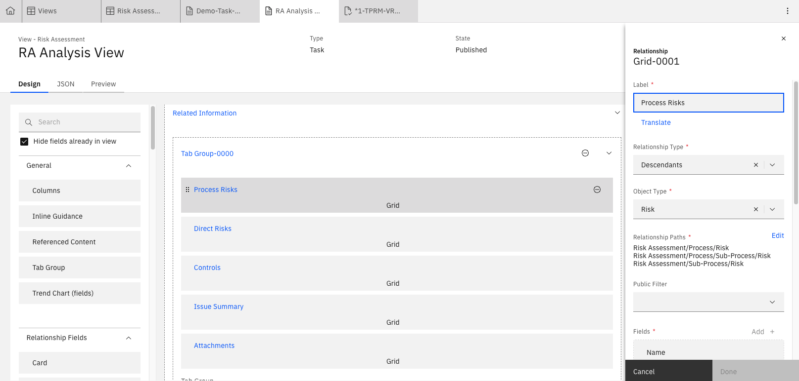
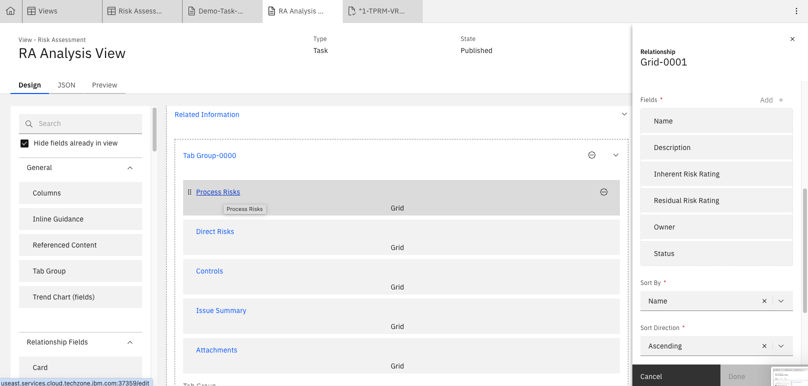

# Lab 3.1: Configuring a Custom View as Input for ML Models

Consider a situation where you want to conduct AI analysis but the inputs don't all belong to a single object. The solution is to create a custom view that contains all the relevant bits of information required to complete the analysis. An example of this would be generating an executive summary for a risk assessment. In this case, we would analyze:
- Processes 
- Risks for each of the processes 
- Controls mitigating the above risks
- Issues identified for each controls
Each of these are different objects but would have relationships. 

---

## 1. Creating the View

1. From the **Administration** menu, go to **Solution Configuration → Views** 

2. Find an appropriate view as a starting point. For this Risk Assessment Executive Summary use-case, we will use the Risk Assessment view (Demo-Task-RiskAssessment-4-ORM) because it will logically contain most of the input data we need. 

3. Copy the view add the following parameters:
  - **Name:** Add a suitable name
  - **Label:** Add a suitable lavel
  - **Type:** `Task` 
  - **Enabled:** ✅ 

3. Go to your new view and add in the relevant object inputs. These are best brought in as grids so that multiple fields for each object can be input into the ML model. Where the relationship type is not direct (either parent/child), select all relevant relationship paths. An example of this is shown below, where **Processes** are a directly related object but **Proces Risks** (**Descendants** relationship type) are not therefore the relationship types must be selected. 

Do the same for:
- Direct Risks; the **Children** relationship type for the **Risk** object (selecting Name, Description, Inherent Risk Rating, Residual Risk Rating, Owner, Status)
- Controls (selecting Name, Description, Design Effectiveness, Operating Effeftiveness, Control Owner, Status)
- Issues (selecting Name, Description, Priority, Lifecycle Due Date, Issue Owner, Issue Status)

4. Publish the view.
