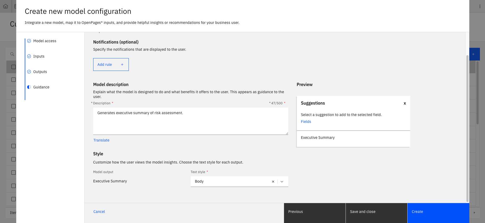
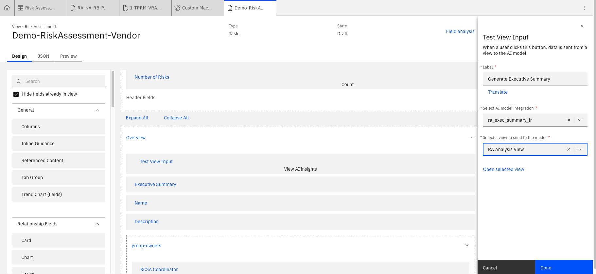

# Lab 3.4: Integrate ML Model and Make Available in View

After deploying the model, the last remaining step is integrating the ML model and making it available in the view we want to interact with it in. 

---

## 1. Integrating Deployed AI Model to OpenPages

1. As with Step 3 in Lab 3.2, integrate your deployed ML model with a view input. The only difference is we want to having meaningful outputs.  

2. For **Outputs**, select **Insight type** as Set fields and select a single insight. For the example prompt we are using, the **JSONata string** will just be `results[0].generated_text`. The **Target field** is `Executive Summary (Demo-RA:Executive Summary)`.

3. Add a suitable description and customise the style to your choosing in **Guidance**. Save the model.

---

## 2. Add the Model to a View 

1. As with step 4 in Lab 3.2, add the new model to the relevant object view (Risk Assessment) and publish. 

---

## 3. Test the Model in OpenPages

1. Find an example Risk Assessment, and run the new Executive Summary Model in the area you placed in the previous step.

---

